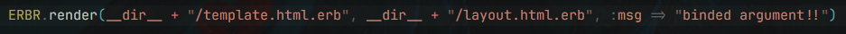
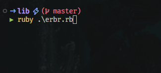

# <div align="center"> erbr </div>
erbr makes the bound and rendering of a given template inside a given layout allowing parameters to be passed and used inside it;
<br>
## Installation
RubyGems:
```
gem install erbr
```
Gemfile: 
```sh
gem "erbr", '~> 0.0.1'
```
<br>

## Usage
ERBR works with a template and optional layout or arguments:
<br>
<div align="center">
    
</div>

If layout is omitted, template is rendered with passed parameters;
<br>

<div align="center">
    
</div>

## Testing
simple as run ```rspec``` at root folder to run behavior driven tests;
<br>

## License
